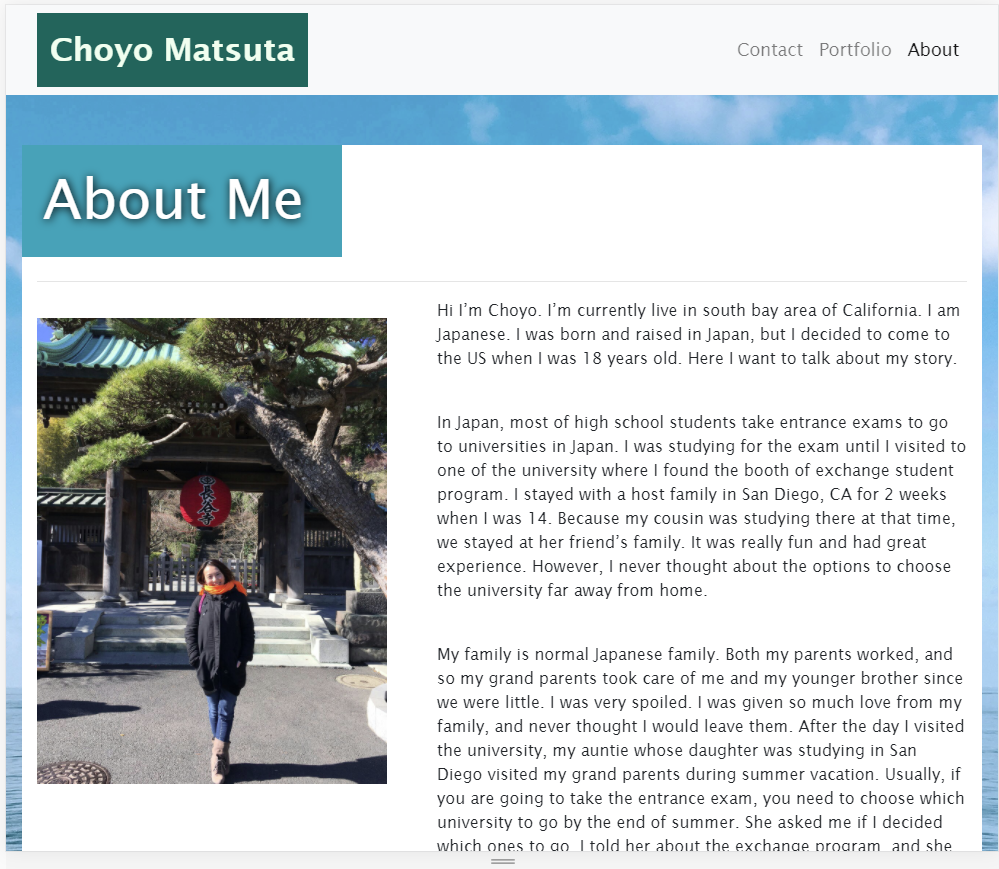
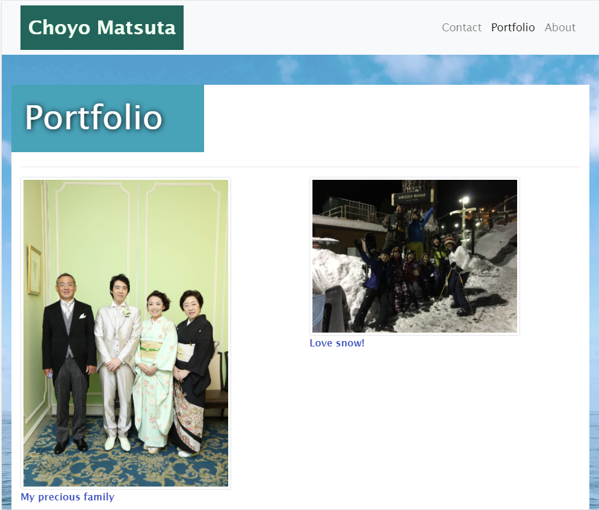
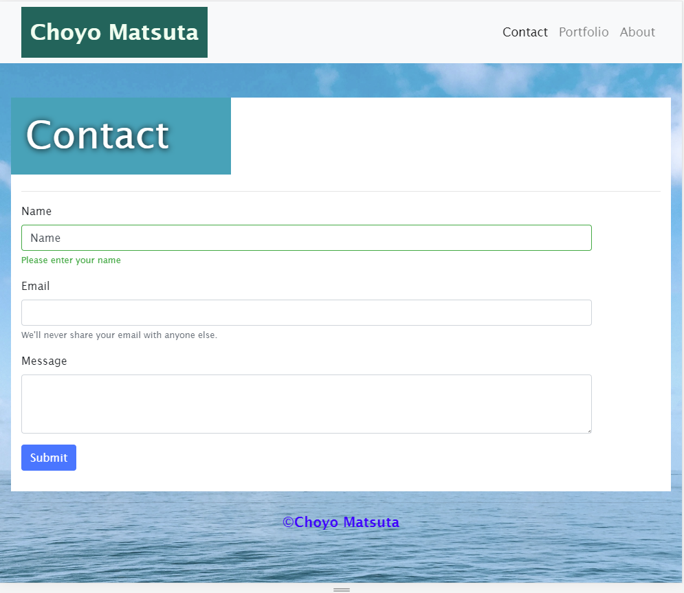
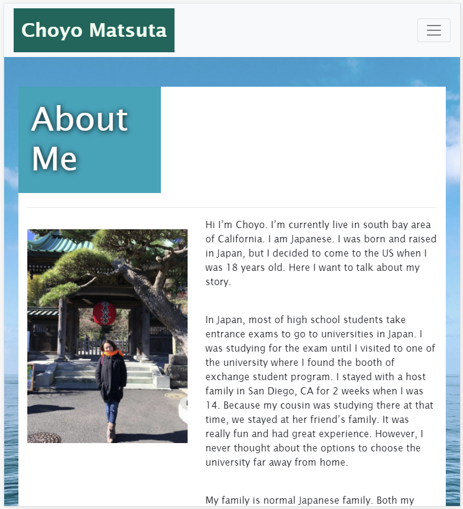
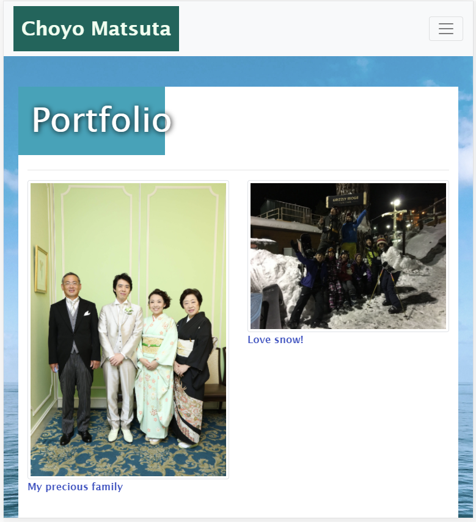
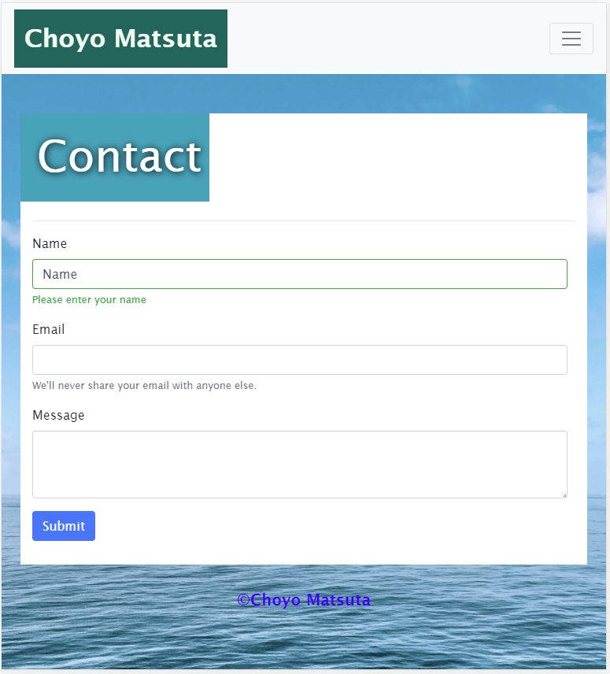
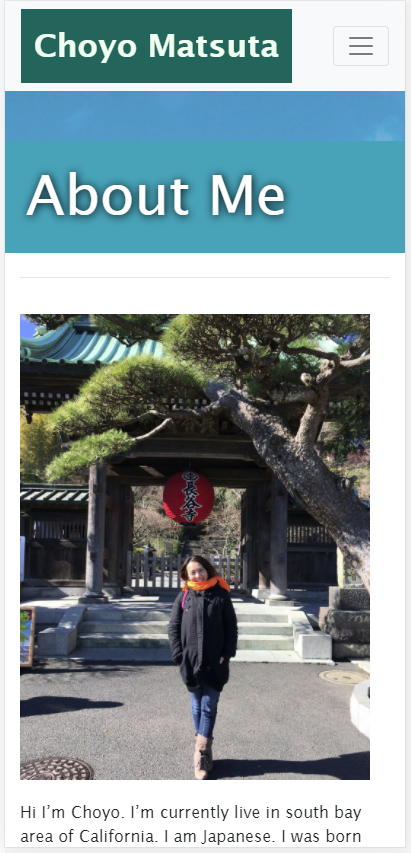
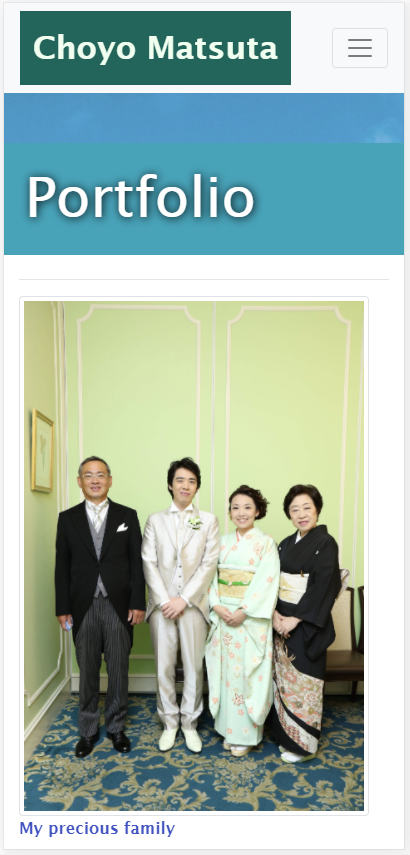
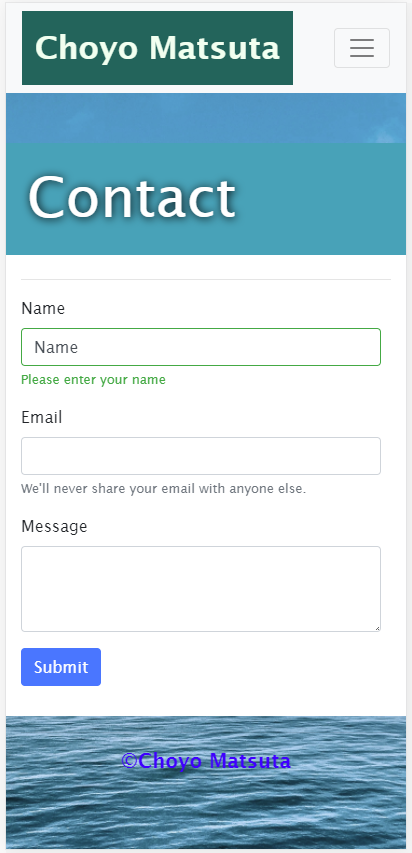

# Unit 02 CSS and Bootstrap Homework: Responsive Portfolio

Create responsive portfolio by using bootstrap

## About me
Used navbar and grid system to write about my story.
Uploaded the picture of me in the image file.

## Contact
Used same navbar for index.html. Used one of forms from bootstrap.
Adjust the form style with css.

## Portfolio
Used same navbar for index.html.
Develop your portfolio.html with focusing on the responsive layout and images.

### Screenshots for the websites
Large (992px)

Medium (768px)

Small (400px)

